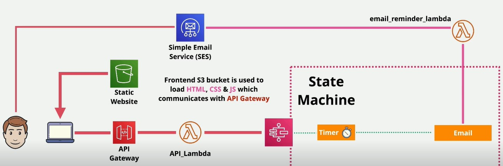

# CareSense (AWS CDK)

CareSense is a serverless healthcare reminder application deployed on AWS using **AWS CDK**.  


## Architecture Diagram


## 🚀 Architecture
The project uses the following AWS services:
- **AWS Lambda**
  - `email_reminder_lambda`
  - `api_lambda`
- **AWS Step Functions**
  - `caresense1` state machine
- **Amazon API Gateway**
  - Endpoint: `https://pywsfe11yg.execute-api.us-east-1.amazonaws.com/Prod`
- **Amazon S3**
  - Static website hosting / storage

---

## 🛠 Project Setup

### Prerequisites
- Python 3.9+
- Node.js 18+ (CDK requires Node)
- AWS CLI configured (`aws configure`)
- AWS CDK installed globally:
  ```bash
  npm install -g aws-cdk
Install dependencies
python -m venv .venv
.venv\Scripts\activate   # Windows
pip install -r requirements.txt

Bootstrap environment (only once per account/region)
cdk bootstrap aws://462498958925/us-east-1

Synthesize CloudFormation template
cdk synth

Deploy (optional if you extend resources)
cdk deploy
